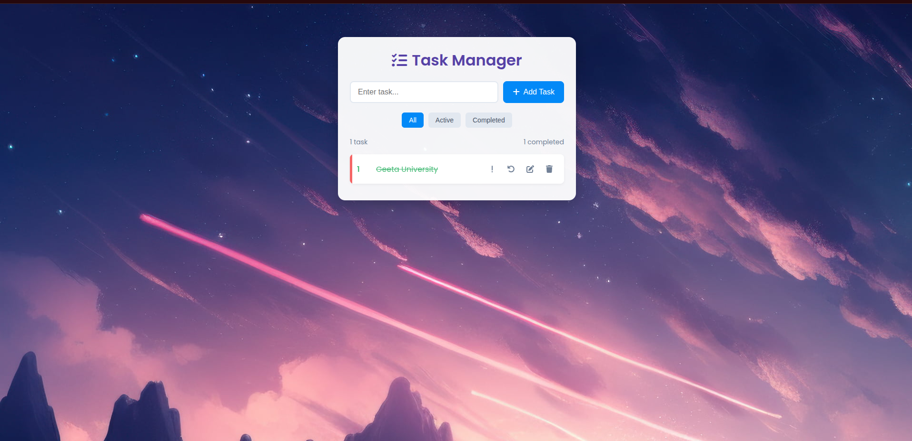

# Enhanced To-Do List Application

![To-Do List Screenshot]

A modern, feature-rich task management application with priority levels, filtering, and local storage persistence.

## Features

- ✅ Add, edit, and delete tasks
- 🏷️ Set task priorities (low, medium, high)
- 🗂️ Filter tasks (all/active/completed)
- 📊 Task statistics tracking
- 💾 Local storage persistence
- 🎨 Sleek, responsive design with animations
- 📱 Mobile-friendly interface
- ⏱️ Created date tracking for tasks

## Technologies Used

- HTML5
- CSS3 (with CSS Variables)
- JavaScript (ES6)
- Font Awesome Icons
- Google Fonts (Poppins)
- LocalStorage API

## Installation

No installation required! Just open the `index.html` file in any modern web browser.

For development:
1. Clone the repository
2. Open `index.html` in your browser
3. Start coding!

