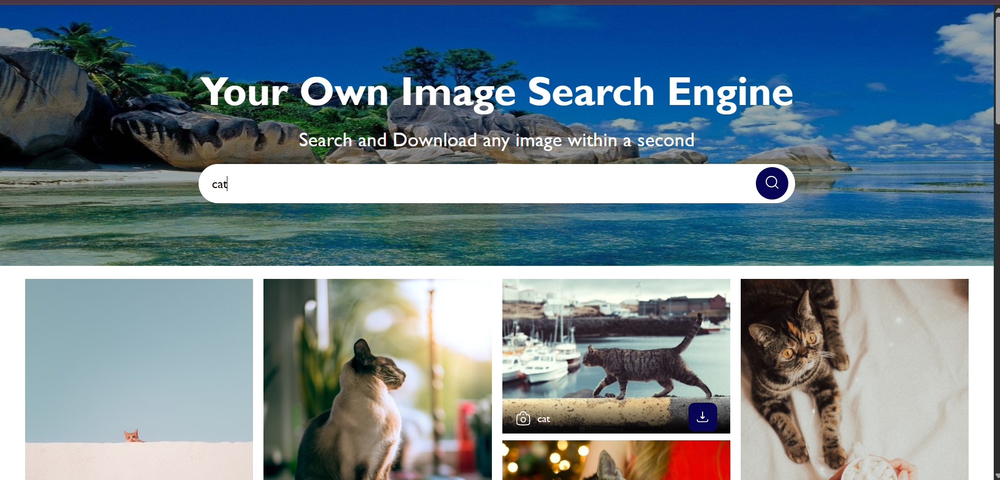

# 🌄 Image Search Engine

## 📖 Overview
This project is a web-based image search engine that allows users to search for and download images using Unsplash API. The website features a responsive UI with a search bar, image gallery, and a "Load More" button for pagination. Users can search for images by entering keywords and download images by clicking a download button on each image.

# 📸 Preview

---

## ⭐ Features
- 🔍 **Search Functionality**: Search for images by keyword using the Unsplash API.
- 📱 **Responsive Design**: Adapts to various screen sizes, including mobile devices.
- 🖼️ **Image Gallery**: Displays images in a masonry-style grid layout.
- ⬇️ **Download Option**: Allows users to download images directly.
- 📄 **Pagination**: Load additional images using a "Load More" button.
- ✨ **Hover Effects**: Images scale up on hover, and details (title and download button) appear.

## 🛠️ Prerequisites
- A modern web browser (e.g., Chrome, Firefox, Safari).
- An active internet connection to fetch images from the Unsplash API.
- A valid Unsplash API key (Access Key).
- A local server to serve the application (e.g. liveserver).

