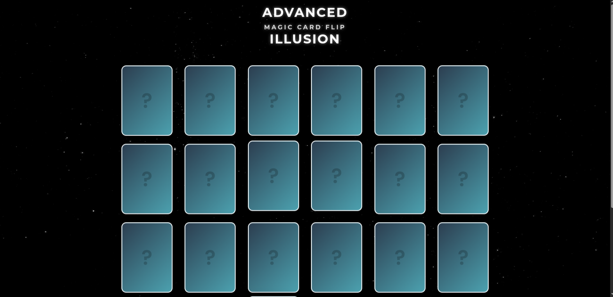

Magic Card Flip Illusion Game


An interactive 3D card matching game featuring mesmerizing optical illusions, built with pure HTML, CSS, and JavaScript.

✨ Features
24 Animated Cards (12 matching pairs)

Smooth 3D Flip Animations (CSS transforms)

6 Unique Optical Illusion Patterns

Hypnotic spirals

Animated checkerboards

Morphing shapes

Color-shifting grids

Dynamic Themes (Light/Dark mode toggle)

Mobile-Friendly Design (Fully responsive)

Matching Game Logic with visual feedback

🚀 Demo
Live Demo Link (http://0.0.0.0:5500/)

🛠️ Tech Stack
Frontend: HTML5, CSS3, JavaScript

Animations: CSS 3D Transforms, SVG animations

Design: Gradient backgrounds, Neumorphic cards

🏁 Getting Started
Prerequisites
Modern web browser (Chrome, Firefox, Edge)

Installation
Clone the repository:

```bash
git clone https://github.com/yourusername/magic-card-flip.git
Navigate to project directory:
```

```bash
cd magic-card-flip
Open the game:
```

```bash
open index.html  # Mac
start index.html # Windows
```

🎮 How to Play
Click any card to flip it

Find its matching pair

Match all cards to win!

Use control buttons to:

🔄 Reset all cards

🎨 Shuffle patterns

🌓 Toggle dark/light mode

📱 Responsive Design
Optimized for all screen sizes:

Desktop (6-column grid)

Tablet (4-column grid)

Mobile (2-column grid)

🖼️ Screenshots
Light Mode	Dark Mode	Mobile View
	
🛠️ Customization
Easily modify:

Add new illusions in script.js

Change colors in styles.css

Adjust card count by modifying cardCount variable

